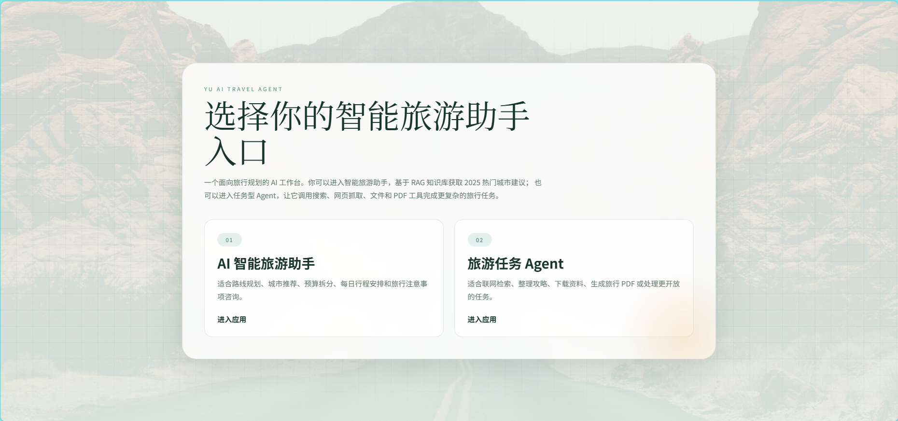
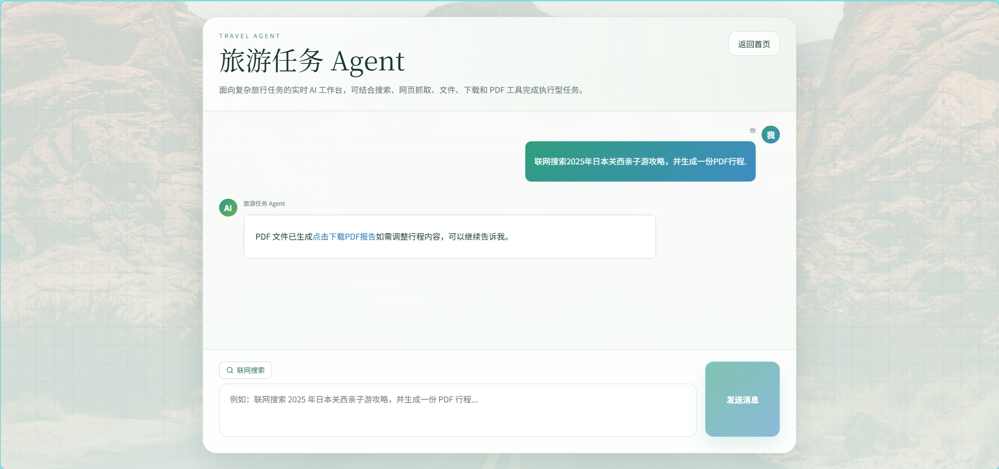

# Yu AI Travel Agent

Yu AI Travel Agent 是一个面向旅行规划场景的智能体项目，包含智能旅游助手、任务型 Agent、RAG 知识库、工具调用、PDF 生成以及高德地图 MCP 接入能力。前端使用 Vue 3 + Vite，后端使用 Spring Boot + Spring AI，适合用于学习和实践 AI Agent 在真实业务场景中的落地方式。

## 界面预览

> 将截图放到 `docs/images/` 目录后，下面的图片会自动显示。






## 核心功能

- 智能旅游规划：根据预算、天数、出发地、偏好和同行人生成旅行方案。
- 高德地图 MCP：在智能规划入口中支持地点搜索、周边推荐、地址查询、路线和距离信息。
- RAG 知识库：基于本地旅游文档补充 2025 热门城市、玩法和避坑建议。
- 任务型 Agent：支持联网搜索、网页抓取、文件操作、资源下载和 PDF 生成。
- 多轮会话记忆：基于 Redis 保存上下文，支持连续对话。
- 前后端分离：后端提供 REST/SSE 接口，前端提供可视化聊天页面。

## 技术栈

后端：

- Java 21
- Spring Boot 3.5.13
- Spring AI / Spring AI Alibaba
- DashScope / Ollama
- Spring AI MCP Client
- Redis
- PostgreSQL / PgVector
- iText PDF
- Hutool / Jsoup

前端：

- Vue 3
- Vue Router
- Vite
- Axios

MCP：

- 高德地图 MCP：`@amap/amap-maps-mcp-server`
- stdio 方式接入 Spring AI MCP Client

## 项目结构

```text
yu-ai-agent
├── src/main/java/com/cxy/travelaiagent
│   ├── App                 # TravelApp 核心对话应用
│   ├── agent               # ReAct / ToolCall / YuAgent
│   ├── advisor             # 日志 Advisor
│   ├── chatMemory          # Redis / 文件会话记忆
│   ├── controller          # AI 接口
│   ├── rag                 # RAG 文档加载、查询增强、向量库配置
│   └── tools               # 搜索、抓取、文件、PDF 等工具
├── src/main/resources
│   ├── application.yml     # Spring 配置
│   ├── mcp-server.json     # MCP 服务配置
│   └── document            # 旅游知识库文档
├── yu-agent-frontend       # Vue 前端
└── yu-image-search-mcp-server
```

## 快速启动

### 1. 准备环境

需要先安装：

- JDK 21
- Maven
- Node.js
- Redis
- PostgreSQL
- Ollama 或 DashScope API Key

建议通过环境变量配置敏感信息：

```bash
DASHSCOPE_API_KEY=你的 DashScope Key
PEXELS_API_KEY=你的 Pexels Key
ALIYUN_OSS_ENDPOINT=你的 OSS Endpoint
ALIYUN_OSS_BUCKET=你的 OSS Bucket
ALIYUN_OSS_REGION=你的 OSS Region
```

高德地图 Key 在 `src/main/resources/mcp-server.json` 中配置：

```json
{
  "mcpServers": {
    "amap-maps": {
      "command": "D:\\nodejs\\node.exe",
      "args": [
        "D:\\myProject\\yu-ai-agent\\.npm-cache\\_npx\\3f19108e4acac271\\node_modules\\@amap\\amap-maps-mcp-server\\build\\index.js"
      ],
      "env": {
        "AMAP_MAPS_API_KEY": "你的高德地图 API Key"
      }
    }
  }
}
```

### 2. 启动后端

```bash
mvn spring-boot:run
```

默认地址：

```text
http://localhost:8123/api
```

### 3. 启动前端

```bash
cd yu-agent-frontend
npm install
npm run dev
```

默认地址：

```text
http://localhost:5173
```

## 主要页面

| 页面 | 地址 | 说明 |
| --- | --- | --- |
| 首页 | `/` | 选择智能旅游助手或任务型 Agent |
| AI 智能旅游助手 | `/travel` | 旅行规划、城市推荐、路线建议、高德 MCP 地图能力 |
| 旅游任务 Agent | `/manus` | 联网搜索、资料整理、下载、PDF 生成等复杂任务 |

## 主要接口

| 接口 | 说明 |
| --- | --- |
| `GET /api/ai/travel_app/chat/sse` | 智能旅游助手流式对话，已接入高德地图 MCP |
| `GET /api/ai/travel_app/chat/sync` | 智能旅游助手同步对话 |
| `GET /api/ai/travel_app/chat/rag` | RAG 知识库问答 |
| `GET /api/ai/travel_app/chat/tools` | 本地工具调用入口 |
| `GET /api/ai/manus/chat` | 任务型 Agent 流式执行 |

## 高德地图 MCP 测试

前端打开：

```text
http://localhost:5173/travel
```

在聊天框输入：

```text
帮我规划上海静安寺附近半日游，推荐3公里内适合吃饭的地方，给出地址和距离
```

或：

```text
请规划北京南站到故宫的路线，并推荐故宫附近适合下午休息的咖啡店
```

后端控制台会打印 MCP 相关日志：

```text
[AMAP_MCP] enabled for TravelApp stream, chatId=..., message=...
[AMAP_MCP] available tools=[...]
```

如果模型实际调用 MCP，还会看到 Spring AI / MCP 的调试日志。日志配置位于 `src/main/resources/application.yml`：

```yaml
logging:
  level:
    com.cxy.travelaiagent.App.TravelApp: INFO
    org.springframework.ai.model.tool: DEBUG
    org.springframework.ai.autoconfigure.mcp: DEBUG
    org.springframework.ai.mcp: DEBUG
    io.modelcontextprotocol: DEBUG
```

## RAG 知识库

知识库文档位于：

```text
src/main/resources/document
```

当前包含：

- `2025旅游规划知识库-玩法与避坑.md`
- `2025热门旅游城市-国内篇.md`
- `2025热门旅游城市-国际篇.md`

可在 `application.yml` 中控制是否初始化文档：

```yaml
travel:
  rag:
    init-documents: false
    init-batch-size: 25
```

## 任务型 Agent 示例

打开：

```text
http://localhost:5173/manus
```

输入：

```text
联网搜索2025年日本关西亲子游攻略，并生成一份PDF行程。
```

Agent 会根据任务自动选择搜索、网页抓取、文件或 PDF 工具，并返回执行结果。

## 截图文件说明

建议将本 README 使用的三张截图放在：

```text
docs/images/home.png
docs/images/travel-chat.png
docs/images/agent-chat.png
```

对应关系：

- `home.png`：首页入口截图
- `travel-chat.png`：AI 智能旅游助手截图
- `agent-chat.png`：旅游任务 Agent 截图

## 注意事项

- 不建议把真实 API Key、数据库密码、Redis 密码直接提交到公共仓库。
- 如果 MCP 启动超时，优先检查 Node 路径、高德 MCP 包路径和 `AMAP_MAPS_API_KEY`。
- 如果前端请求失败，确认 Vite 代理和后端端口 `8123` 是否正常。
- 如果 Maven 首次启动较慢，通常是依赖下载导致，等待依赖缓存完成后会恢复正常。

